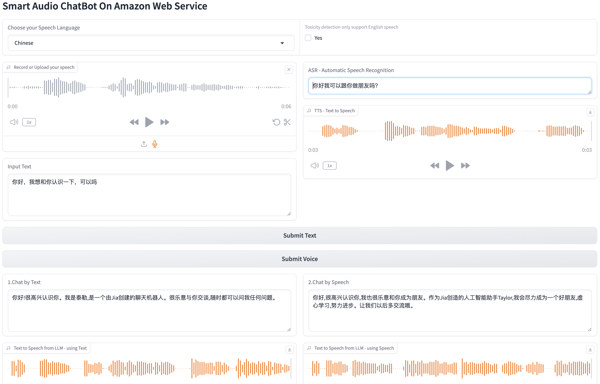

# SmartMultiModeChatBot

This is a Python project that allows you to:
1. Perform toxic detection using Amazon Transcribe
2. Transcribe an Audio file/Speech using Amazon Transcribe
3. Convert text into lifelike speech using Amazon Polly
4. Implement intelligent voice/text interaction conversation using LLM named Claude3-Sonnet on Amazon Bedrock
the user-friendly interface built with Gradio.

# WebUI of SmartMultiModeChatBot


# Quick Start
Start Stack on Amazon Web Service
If you have AWS Account, you can:
1. Navigate to AWS CloudFormation
2. Specify this [template](template/smartChatbot.yaml)
3. Quickly pull up all the resources needed for the solution.
4. Then Go into “Installation” Step.

# Installation

Clone the repository:

```
git clone https://github.com/jiaMery/SmartMultiModeChatBot.git
```

Navigate to the project directory:

```
cd SmartMultiModeChatBot
```


Create a virtual environment (optional but recommended), I tested my script on
Python 3.12:

```
python3 -m venv env
source env/bin/activate
```

or with conda:

```
conda create -n smartChatbot

conda activate smartChatbot
```

Install the required packages:

```
pip install -r requirements.txt
```

Start the application:

```
python webui7.py
```

Upload an audio file (in .mp3, .wav, or .flac format).

Click the "Submit" button to start the transcription process.

Wait for the application to transcribe the audio file and display the results.